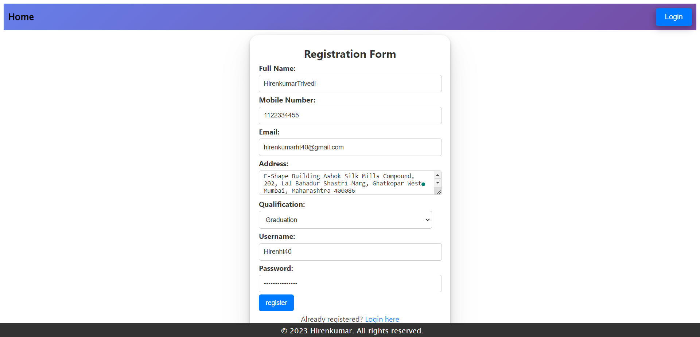
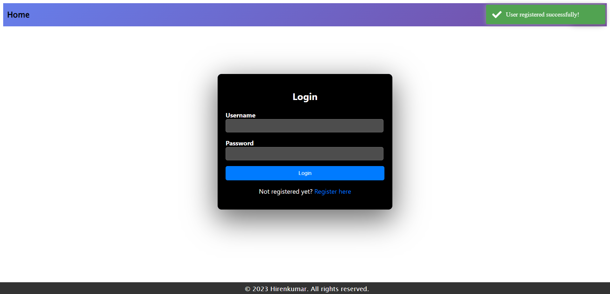
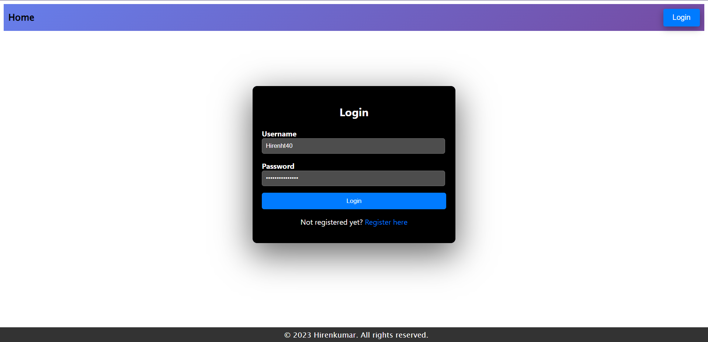
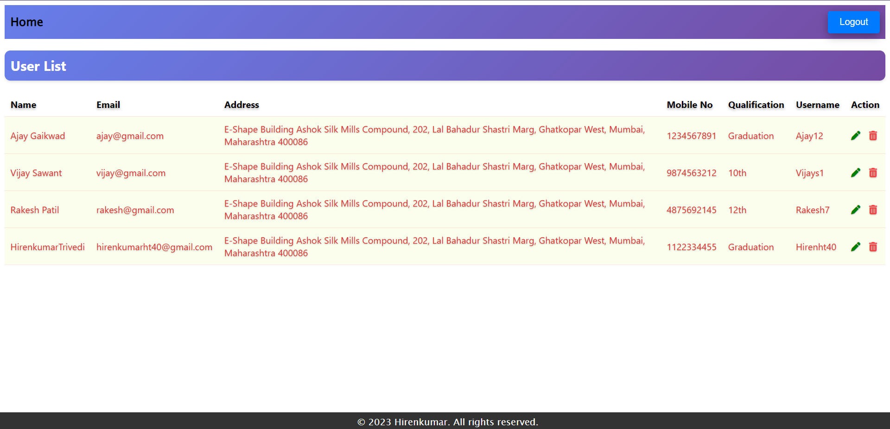
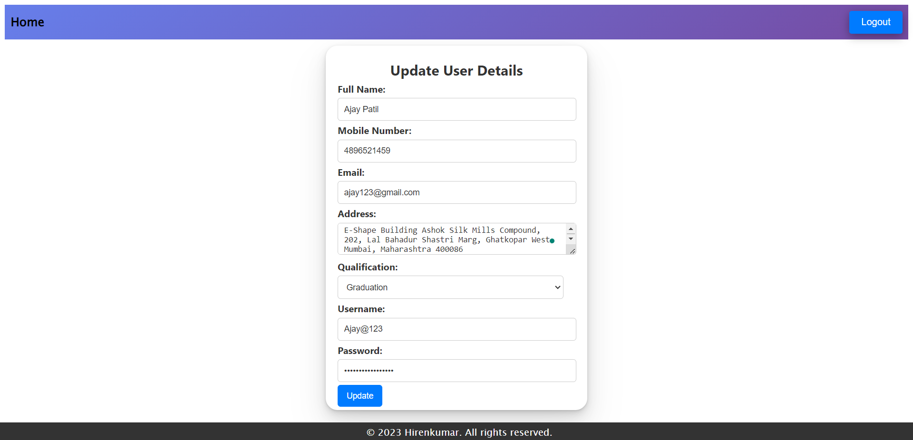
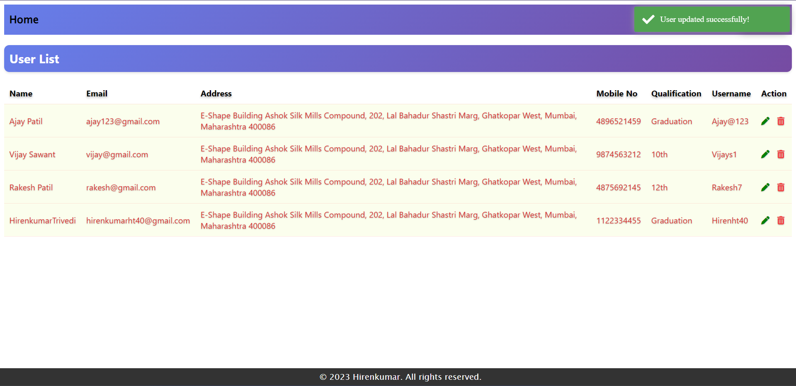
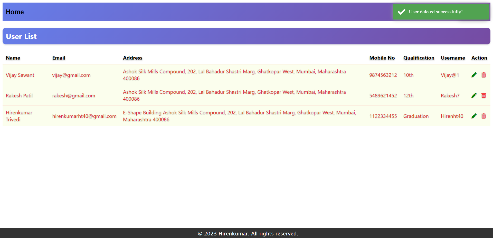
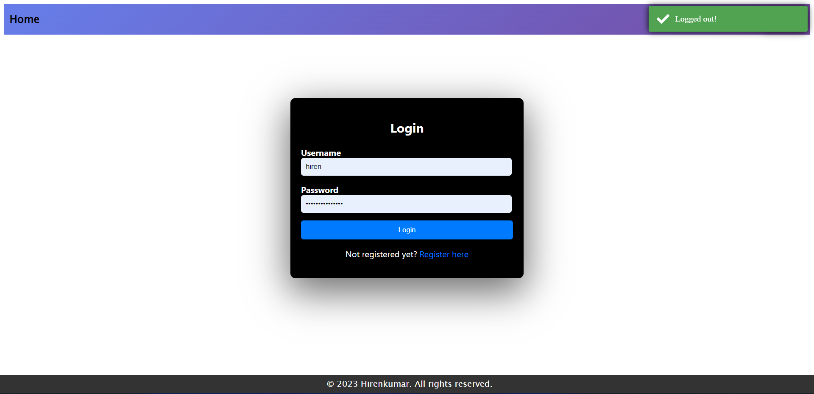

# Hi there 👋

## Project Name : **User Management System**

This project is a MEAN stack application that enables users to register, log in, view user details, update user information, delete user , and log out. JWT (JSON Web Tokens) are utilized for authentication, ensuring secure access to the user's data.

 

# 💻 Tech Stack Used :

        

 

 

 

### My Project is looking like :

#### 1 User Registration

#### 2 User Registered successfully

#### 3 Login

#### 4 User details page once logged in

#### 5 Update user details

#### 6 User details updated successfully

#### 7 Delete user

#### 8 Logout

### You can Check it Live on Below Link :

[Deplyoed link!](https://user-management-system-iszg-8m6p73vql-hirenht40.vercel.app/)
